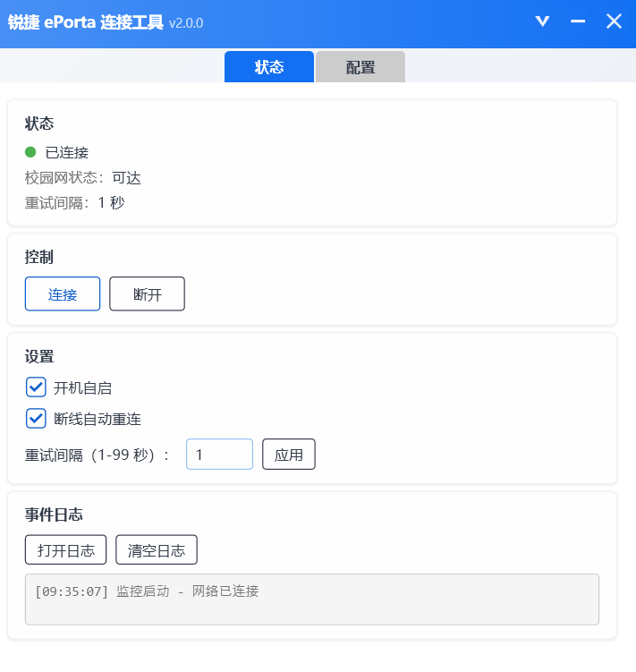
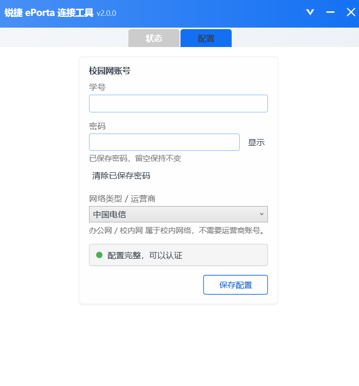

# Ruijie ePorta Tool

锐捷 ePorta Web 认证客户端，适用于西华大学校园网。


## 功能

- 图形化连接、断开校园网
- 支持电信、移动、联通、校内网、办公网
- 断线自动重连
- 自动获取认证所需参数，无需手动抓包和填写
- 自动选择可用的校园网网络接口
- 支持开机自启
- 支持保存账号配置，密码使用 Windows DPAPI 加密存储

## 界面预览

| 状态页面                                   | 配置页面                                 |
| ------------------------------------------ | ---------------------------------------- |
|   |  |

## 下载

前往 [Releases](https://github.com/angelica-bz/Ruijie-ePorta-Tool---XHU/releases/latest) 下载最新版本。

下载后直接运行 `Ruijie ePorta Tool.exe` 即可。

## 使用

首次运行后：

1. 打开「配置」页面。
2. 填写学号和密码。
3. 选择对应的网络类型。
4. 点击「保存配置」。
5. 回到「状态」页面，点击「连接」。

开启「自动重连」后，程序会在检测到校园网断开时自动重新认证。

## 网络类型

根据你使用的校园网选择：

| 网络类型 | 适用情况 |
| -------- | -------- |
| 电信网   | 电信宽带 |
| 移动网   | 移动宽带 |
| 联通网   | 联通宽带 |
| 校内网   | 校园内网 |
| 办公网   | 办公区域 |

当前 ePortal Web 认证中，学号直接作为账号使用，网络类型由程序自动提交对应的服务选项。

> `@96301`、`@cmccgx`、`@unicom` 属于宽带拨号账号的用户名后缀语义，不是本工具当前 ePortal Web 登录时的学号格式。

## 常见问题

### 点击连接后认证失败

检查学号、密码以及网络类型是否正确。

### 提示找不到可访问的校园认证网络

确认电脑已经连接西华大学校园网，并检查 VPN、TUN 等虚拟网络软件是否影响网络连接。

程序会自动选择可用的网络接口。

### 换电脑后需要重新输入密码

密码使用 Windows DPAPI 保存，与当前 Windows 用户和设备环境相关。将配置文件复制到其他电脑后，需要重新输入密码。

### 门户要求验证码

正常情况下无需验证码。

如果门户临时要求验证码，程序会提示需要人工处理。

### 配置文件在哪里

`config.yml` 与程序位于同一目录。

密码不会以明文形式保存。

## 开机自启

可以在程序中开启开机自启。

也可以将程序快捷方式放入 Windows 启动目录：

```text
shell:startup
```

## 从源码构建

开发环境：

- Windows
- Visual Studio 2022
- .NET Framework 4.8

使用 Visual Studio 打开：

```text
Ruijie-WPF.sln
```

然后生成解决方案。

也可以使用 MSBuild：

```powershell
msbuild Ruijie-WPF.sln /t:Rebuild /p:Configuration=Release
```

## 项目说明

本项目基于 [Redlnn/Ruijie-ePorta-Tool](https://github.com/Redlnn/Ruijie-ePorta-Tool) 的思路进行 WPF + VB.NET 实现。

UI 使用了 [Plain Craft Launcher](https://github.com/Meloong-Git/PCL) 的部分控件与动画相关代码。

## 许可证

本项目采用 [AGPL-3.0](LICENSE) 许可证。
